# SoulChain: An Open-Source, Decentralized AI-Powered Dating Platform

## Abstract

**SoulChain** is an innovative, open-source dating platform designed to transform the online dating experience by providing users with meaningful connections while allowing them to maintain full control over their personal data. Using the energy-efficient Solana blockchain and Rust-based smart contracts, SoulChain prioritizes transparency, inclusivity, and user empowerment. The platform uniquely integrates blockchain technology with AI-driven personalization to deliver a secure, efficient, and trustworthy matchmaking process. By incorporating Explainable AI (XAI) to ensure algorithmic transparency, implementing decentralized governance through a Decentralized Autonomous Organization (DAO), and guaranteeing user sovereignty over data, SoulChain creates a fully user-centric experience.

SoulChain's mission is to reimagine online dating by addressing long-standing challenges in privacy, bias, and exploitation while fostering a community-driven ecosystem. By leveraging the decentralized, transparent, and equitable qualities of blockchain and Web3 technologies, SoulChain challenges the profit-driven models of traditional dating platforms. Instead of treating users merely as consumers, it invites them to become active participants and stakeholders, fundamentally changing how dating apps operate.

## Introduction

Over the past decade, online dating has grown into a global phenomenon, serving hundreds of millions of users and driving an industry valued at $8.9 billion in 2023. Projections indicate the market could nearly triple in value, reaching $21.8 billion by 2033 [^1]. However, despite this impressive growth, the industry is bothered by persistent issues that threaten user trust and satisfaction. These challenges include widespread data privacy concerns, biased algorithms, profit-oriented business models, and limited user control over personal information [^2].

 

<figure>
  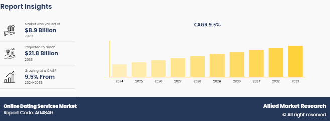
  <figcaption><em>Figure 1: Growth of the online dating industry, from $8.9 billion in 2023 to a projected $21.8 billion by 2033.</em></figcaption>
</figure>

 
 

Mainstream dating platforms such as [Tinder](https://tinder.com), [Bumble](https://bumble.com), and [Hinge](https://hinge.co) rely on centralized systems where user data is stored on private servers controlled by the platform operators. This approach not only increases the risk of data breaches but also leaves users with little insight or control over how their data is used. A high-profile example of such vulnerabilities occurred in 2021, when a breach exposed sensitive data from millions of users across several major dating apps [^3]. Beyond privacy issues, the opaque algorithms used by these platforms often prioritize metrics like user engagement and swipe frequency over genuine compatibility. As a result, users may feel dissatisfied with their matches, believing that deeper compatibility factors are overlooked. Furthermore, these platforms monetize their services by introducing costly subscription tiers, pay-to-play features, and microtransactions, often with unclear benefits or outcomes [^4].

 

<figure>
  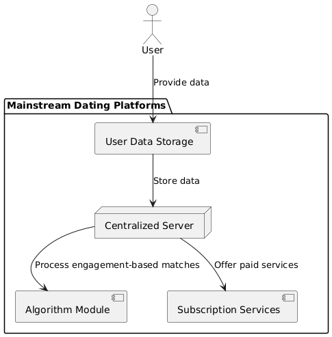
  <figcaption><em>Figure 2: Component Diagram showing how user data is stored and processed in centralized servers on traditional dating platforms.</em></figcaption>
</figure>

 
 

SoulChain seeks to address these issues head-on by introducing a decentralized, transparent, and user-focused alternative that gives individuals control over their data, enhances trust in matchmaking, and promotes a fair and inclusive online dating experience.

 

<figure>
  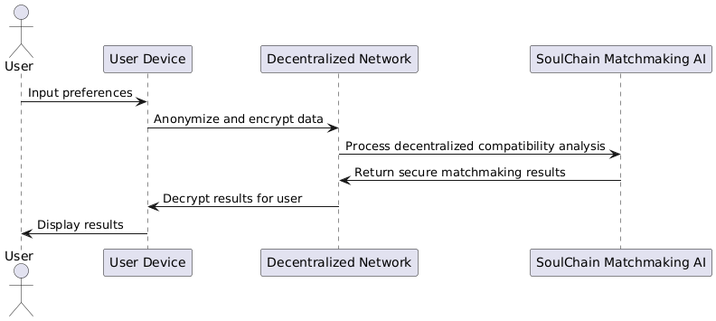
  <figcaption><em>Figure 3: Sequence Diagram demonstrating SoulChain's decentralized approach to secure and transparent matchmaking.</em></figcaption>
</figure>

 
 

## Market Challenges

The traditional dating industry's reliance on centralized systems has created significant obstacles for both users and developers, most notably regarding data security and user trust. One of the most pressing concerns is the vulnerability of centralized databases, which store vast amounts of sensitive information. These systems are attractive targets for hackers, as seen in the July 2023 breach of the 419 Dating - Chat & Flirt app, which exposed over 2.3 million user records. The stolen data included highly sensitive details like social numbers, email addresses, and passwords, highlighting the inherent risks of centralized data storage [^5]. With growing public awareness of privacy issues, users are increasingly concerned about how their data is managed. A 2023 survey found that 57% of U.S. adults were worried about the volume of information collected by dating apps [^6].

 

<figure>
  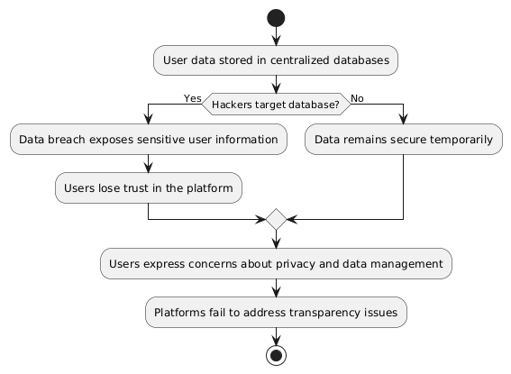
  <figcaption><em>Figure 4: Activity Diagram highlighting the risks of centralized data storage, including breaches and user concerns over privacy.</em></figcaption>
</figure>

 
 

Another issue is the lack of transparency in the monetization strategies of traditional platforms. Many apps offer "premium" features such as boosted profile visibility or advanced search filters, but users often feel unclear about how these services function. Algorithms that influence matchmaking and visibility are typically proprietary and opaque, leading to user frustration. A Pew Research Center study found that nearly half of all online daters, particularly women, reported negative experiences with these platforms [^7]. Additionally, a separate study by MeasuringU revealed that only 11% of users felt their dating app provided effective matches, with many expressing dissatisfaction over the high costs of premium features [^8].

 

<figure>
  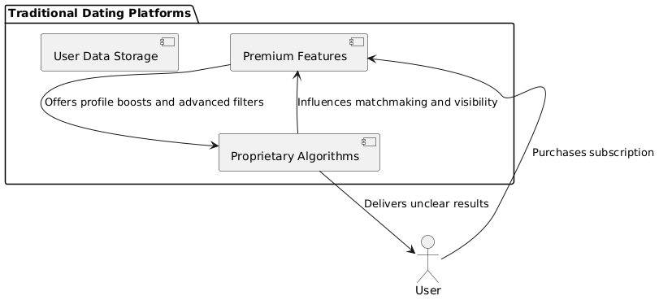
  <figcaption><em>Figure 5: Component Diagram illustrating the monetization strategies of traditional platforms and user dissatisfaction with premium features.</em></figcaption>
</figure>

 
 

Blockchain technology offers a promising solution to these challenges through decentralization, which eliminates reliance on a single entity to store and manage data. Decentralized systems distribute data across a network of nodes, significantly reducing the risk of large-scale breaches. Blockchain's immutable ledger ensures that data cannot be altered without network consensus, guaranteeing transparency and trustworthiness. These principles address core issues like data security, identity verification, and user privacy [^9].

 

<figure>
  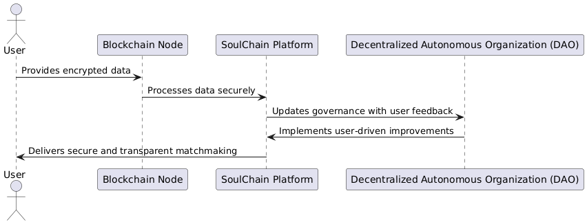
  <figcaption><em>Figure 6: Sequence Diagram demonstrating how blockchain decentralization enhances security, transparency, and user privacy in dating platforms.</em></figcaption>
</figure>

 
 

Furthermore, blockchain technology promotes a sense of ownership among users by enabling direct participation in platform governance. Unlike traditional dating apps that prioritize profit, decentralized systems like SoulChain use governance models such as DAOs to align platform development with user interests. This approach ensures that the platform evolves based on user needs rather than the financial goals of a centralized corporation [^10].

 

<figure>
  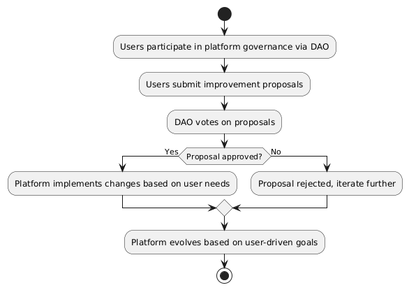
  <figcaption><em>Figure 7: Activity Diagram showing user participation in platform governance via decentralized autonomous organizations (DAOs).</em></figcaption>
</figure>

 
 

## Blockchain and Decentralization

Blockchain's transformative potential lies in its ability to ensure security, transparency, and user empowerment. In the context of SoulChain, blockchain addresses critical pain points of traditional dating platforms by decentralizing data storage and governance. Rather than relying on a single authority, SoulChain leverages a distributed ledger where users maintain ownership of their data. This eliminates the risk of centralized data breaches, a persistent issue in the online dating industry [^11].

SoulChain also empowers users through its decentralized governance model, enabled by a DAO. In this structure, governance tokens allow users to vote on essential decisions, such as updates to matchmaking algorithms, feature rollouts, and community policies. This ensures that the platform evolves democratically and reflects the collective will of its user base rather than the profit-driven goals of a central authority. By embracing Web3 principles, SoulChain prioritizes user sovereignty, privacy, and inclusivity [^12].

Another critical benefit of blockchain technology is its immutability. Once data is recorded on the blockchain, it cannot be altered, ensuring that all platform transactions and decisions are transparent and trustworthy. This allows users to audit matchmaking algorithms, platform updates, and governance decisions, ensuring fairness and accountability. Traditional dating platforms, by contrast, operate as black boxes, providing no visibility into how their systems work or how decisions are made [^13].

## Explainable AI (XAI)

SoulChain's matchmaking system incorporates Explainable AI (XAI), a groundbreaking approach to artificial intelligence that prioritizes transparency and interpretability. Traditional AI systems often function as "black boxes", making decisions without offering users any insight into how they were reached. This opacity can lead to frustration and mistrust, particularly in a context as personal as online dating [^14].

By using XAI, SoulChain ensures that users can understand the factors behind their matchmaking recommendations. For instance, users can see how shared interests, values, personality traits, and preferences influenced a particular match. This transparency not only builds trust but also allows users to feel more in control of their dating experience. Additionally, XAI helps identify and eliminate biases in the matchmaking process, ensuring fair treatment for all users regardless of background or identity [^15].

Inclusivity is a core principle of SoulChain's design. Unlike traditional platforms that may inadvertently prioritize certain demographics or characteristics, SoulChain uses XAI to create an equitable and personalized experience for all. By providing detailed insights into the algorithm's decision-making process, SoulChain promotes accountability and ensures that the platform serves a diverse user base [^16].

## Specialized Language Model (SLM)

At the heart of SoulChain's matchmaking system is the **Specialized Language Model (SLM)**, an advanced AI framework meticulously designed to analyze and predict nuanced aspects of human compatibility. Unlike traditional dating platforms, which often rely on shallow matching criteria like age, location, and limited preferences, the SLM goes far deeper. It leverages **federated, anonymized data** to perform a comprehensive compatibility analysis while upholding robust privacy standards. By integrating cutting-edge technology with an emphasis on data sovereignty, the SLM delivers a uniquely personalized and secure matchmaking experience [^17].

 

<figure>
  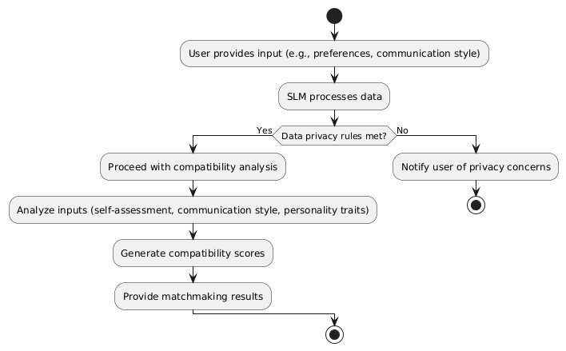
  <figcaption><em>Figure 8: Activity Diagram of the Specialized Language Model (SLM) processing user input and generating matchmaking results.</em></figcaption>
</figure>

 
 

One of the SLM's standout features is its ability to perform **multilayered compatibility analysis**, going beyond surface-level inputs to deliver matches that are thoughtful, precise, and enduring. The system processes a wide range of user data, including:

- **Self-assessed compatibility inputs**: Users evaluate what matters most to them in a partner, such as shared hobbies, personal values, or long-term life goals.
- **Communication styles**: For example, the model considers whether a user prefers direct, straightforward conversations or thrives on subtle, emotionally layered exchanges.
- **Personality frameworks**: Established psychological models such as the Myers-Briggs Type Indicator (MBTI) and the Big Five Personality Traits are incorporated to paint a fuller picture of each individual.

 

<figure>
  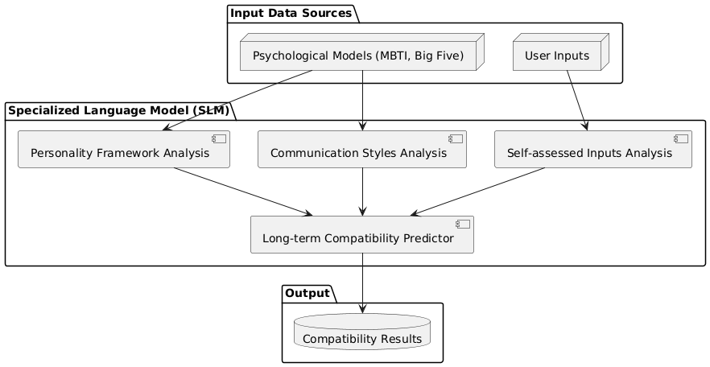
  <figcaption><em>Figure 9: Component Diagram of the SLM's analysis layers and their integration with input data sources and output results.</em></figcaption>
</figure>

 
 

This detailed analysis enables the SLM to predict not just immediate compatibility but also how two individuals might fare in a long-term relationship. For instance, if one person is highly extroverted and energized by social events while the other values quiet, intimate moments, the SLM evaluates how these traits may complement-or potentially challenge-each other. By analyzing these dynamics, the SLM delivers matches that are grounded in a deep understanding of human psychology, increasing the likelihood of meaningful and fulfilling connections.

 

<figure>
  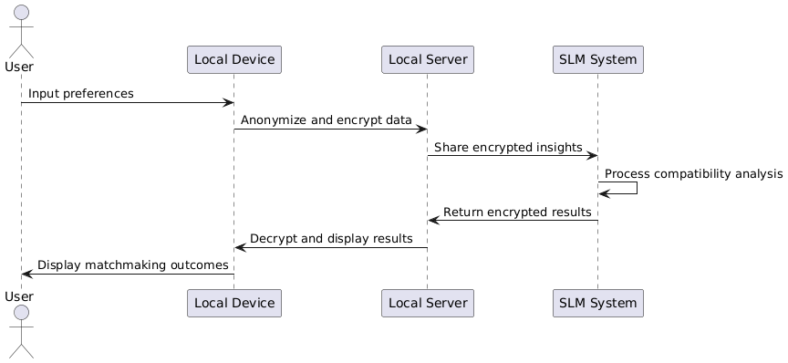
  <figcaption><em>Figure 10: Sequence Diagram illustrating the interaction between the user, local devices, and the SLM system for secure data processing.</em></figcaption>
</figure>

 
 

Another groundbreaking feature of the SLM is its reliance on a **decentralized data federation model**, a paradigm shift from the centralized systems used by most other matchmaking platforms. Traditional centralized platforms store sensitive user data in massive, centralized databases, which are frequent targets for cyberattacks and privacy breaches. In contrast, the SLM decentralizes the storage and processing of user data, ensuring greater security and privacy [^18].

Key advantages of this approach include:

- **Enhanced security**: Since no single database stores all the user information, the risk of large-scale breaches is significantly reduced.
- **Data sovereignty**: Users maintain complete ownership and control of their data, accessing it only through secure private keys.
- **Transparency and trust**: With decentralized processing, SoulChain eliminates concerns about corporate misuse of personal information, promoting a sense of trust among its users.

For example, user preferences and interactions are processed locally on their devices or through localized servers. The resulting insights are then shared with the matchmaking system in an anonymized, encrypted form. This ensures that the user maintains control over their sensitive information while still benefiting from the SLM's advanced capabilities. This decentralized approach aligns with SoulChain's commitment to privacy, enabling users to participate in the platform with confidence [^19].

Moreover, the concept of continuous learning in AI, as used in systems like SoulChain's Specialized Language Model (SLM), aligns with how advanced algorithms evolve over time by adapting to user feedback and behavioral patterns. For example, AI systems utilize machine learning techniques to analyze large datasets, identifying patterns that allow for deeper personalization and improved recommendations. Such approaches help refine results in real-time based on user preferences, enhancing the accuracy and relevance of services provided.

Virtusa's research highlights that AI-powered personalization leverages user interactions, such as preferences, behavioral trends, and feedback, to anticipate and respond dynamically to user needs. This capability ensures that AI systems continuously enhance their decision-making processes, which promotes user trust by making the system more transparent and adaptive to their needs [^20].

The ability to identify and mitigate biases in AI systems is another critical feature. Continuous learning allows AI to uncover hidden biases in datasets and refine algorithms to offer equitable outcomes. This is particularly important in matchmaking systems, where diversity and inclusivity are vital for fair treatment across various user demographics.

A study by Frontiers in AI governance highlights the role of transparency in addressing biases. It emphasizes that systems must remain interpretable, allowing users to understand how decisions are made, and that continuous feedback loops are essential for eliminating unintentional biases over time. This approach ensures equitable and inclusive user experiences, particularly in applications that heavily rely on personal or demographic data [^21].

 

<figure>
  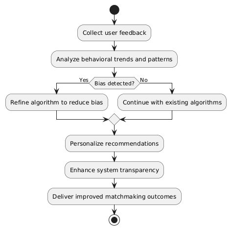
  <figcaption><em>Figure 11: Activity Diagram of the feedback loop for continuous learning and bias mitigation within the SLM.</em></figcaption>
</figure>

 
 

In practical terms, companies like [Spotify](https://open.spotify.com) and [Netflix](https://www.netflix.com) have implemented similar dynamic learning models, using user interaction data to refine their algorithms and provide hyper-personalized recommendations. These methods help users see the immediate impact of their feedback, creating a transparent system that aligns with their preferences over time. SoulChain's use of continuous learning in the SLM operates on similar principles to provide personalized matchmaking experiences while maintaining trust and equity.

 

<figure>
  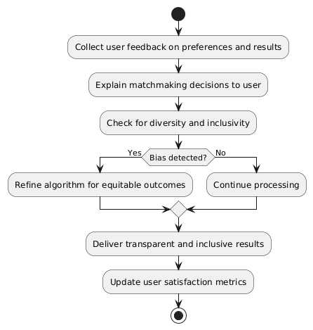
  <figcaption><em>Figure 12: Activity Diagram demonstrating the SLM's approach to ensuring inclusivity and transparency in matchmaking results.</em></figcaption>
</figure>

 
 

By combining these insights, it's clear that AI-powered systems like the SLM benefit from continuous learning and transparency, both of which are crucial for personalization, trust, and equitable outcomes.

## Data Sovereignty

SoulChain places data sovereignty at the heart of its platform, ensuring that users have full control over their personal information. Unlike traditional apps that store user data on centralized servers, SoulChain uses the Solana blockchain to secure data in a decentralized manner. This approach eliminates reliance on third-party data brokers and ensures that only users with the proper private keys can access or share their information. This method provides exceptional security and privacy, addressing growing concerns among online daters [^22].

Traditional platforms often exploit user data for advertising or resale, but SoulChain's blockchain-based model guarantees transparency. Users can decide how their data is shared, creating a more trust-based relationship between the platform and its users. A 2023 Pew Research Center survey highlighted that privacy concerns remain a top priority for many dating app users, making SoulChain's privacy-centric approach especially relevant [^23].

By empowering users with full data control, SoulChain not only aligns with modern privacy expectations but also enhances trust and confidence in the platform.

## Community Governance

SoulChain's governance relies on a DAO structure that ensures users play an active role in shaping the platform's future. Through governance tokens, users can vote on critical decisions such as algorithm changes, feature development, and community initiatives. This decentralized model fosters a sense of ownership and accountability, distinguishing SoulChain from traditional platforms [^24].

Incentives further drive participation. Users can earn governance tokens by contributing to platform improvement, such as submitting feedback, reporting issues, or engaging in discussions. This democratized governance structure ensures that the platform evolves in response to user needs while maintaining transparency and fairness [^25].

## Rust and Solana

SoulChain leverages the Solana blockchain for its high performance and scalability, alongside the Rust programming language for secure, efficient smart contracts. Solana's Proof of History (PoH) consensus mechanism enables thousands of transactions per second, meeting the needs of a growing user base. Meanwhile, Rust's focus on memory safety and performance ensures that the platform remains secure and responsive, even as its user base expands [^26]. This combination of technologies positions SoulChain as a robust, scalable solution for global adoption [^27].

## Conclusion

In essence, SoulChain represents a significant advancement in the online dating industry, offering a decentralized and user-centric alternative to traditional platforms bothered by privacy concerns, algorithmic opacity, and profit-driven models. By integrating blockchain technology with AI-driven matchmaking, SoulChain addresses these long-standing challenges, ensuring users maintaining full ownership of their data while benefiting from a transparent and secure matchmaking process. Unlike mainstream platforms that store sensitive user information on centralized servers, SoulChain leverages the Solana blockchain to decentralize data storage, significantly reducing the risks of breaches and misuse. This approach reflects a growing demand for platforms that prioritize privacy, security, and user empowerment in an increasingly data-sensitive world.

The platform's use of Explainable AI marks a transformative step in promoting trust and inclusivity in online matchmaking. Traditional AI systems often operate as opaque "black boxes", leaving users in the dark about how decisions are made. In contrast, SoulChain's XAI-based matchmaking system provides transparency, enabling users to understand the factors influencing their matches, such as shared values, communication styles, and personality traits. This approach not only enhances user confidence in the platform but also actively mitigates biases in the matching process, creating a fair and inclusive experience for all. By combining AI with a deep respect for data sovereignty, SoulChain ensures a matchmaking process that is both equitable and deeply personalized.

SoulChain's decentralized governance model, enabled by a Decentralized Autonomous Organization, empowers users to shape the platform's evolution actively. This user-driven approach allows for democratic decision-making on key issues, such as algorithm updates and feature implementations, ensuring that the platform grows in alignment with the needs and preferences of its community. Incentivizing participation through governance tokens further encourages user involvement, promoting a collaborative ecosystem where the collective will drives development. This stands in contrast to traditional platforms, which prioritize profit over user satisfaction and often operate without meaningful input from their user base.

Finally, SoulChain's robust technical infrastructure, built on the Solana blockchain and Rust-based smart contracts, ensures scalability, security, and efficiency. Solana's high throughput capabilities enable the platform to handle a growing user base without compromising performance, while Rust's emphasis on memory safety and execution speed guarantees reliable operation. These technical foundations, coupled with the platform's commitment to transparency and user empowerment, position SoulChain as a groundbreaking solution for online dating, confident to redefine how meaningful connections are formed in the digital age. By aligning cutting-edge technology with ethical and user-focused principles, SoulChain offers not just a platform but a vision for the future of online relationships.

## References

[^1]: Allied Market Research. Online Dating Services Market Size, share, Competitive Landscape and Trend Analysis Report, by service, by subscription, by Demography: Global Opportunity Analysis and Industry Forecast, 2024-2033 . Allied Market Research. https://www.alliedmarketresearch.com/online-dating-services-market.
[^2]: Khalatian, Igor. 2024. Matchmaking 2.0: How AI is revolutionizing Online Dating . Forbes, August 13. https://www.forbes.com/councils/forbestechcouncil/2023/03/17/matchmaking-20-how-ai-is-revolutionizing-online-dating.
[^3]: Bîzgă, Alina. 5 Dating Apps Leak More than 1 Million User Profiles and Sensitive Information . Hot For Security. https://www.bitdefender.com/en-us/blog/hotforsecurity/5-dating-apps-leak-more-than-1-million-user-profiles-and-sensitive-information.
[^4]: Anon. 2023. Algorithmic Colonization of Love: The ethical challenges of dating app algorithms in the age of AI . Philarchive. https://philarchive.org/archive/WANACO-6.
[^5]: Bîzgă, Alina. Unprotected dating database exposes data of 2.3 million users . Hot For Security. https://www.bitdefender.com/en-us/blog/hotforsecurity/unprotected-dating-database-exposes-data-of-2-3-million-users.
[^6]: Chekalov, Maxym. 2024. 12 Internet privacy statistics that every American should know 2023 . TechJury - Tech Insights, Reports And Analysis. https://techjury.net/blog/internet-privacy-statistics.
[^7]: Friedman, Sara. 2024. Are dating apps dying out? . The Hustle, August 25. https://thehustle.co/news/are-dating-apps-dying-out.
[^8]: Ms, Leah Samuelson, Laureon Merrie PhD, Jim Lewis PhD, and Jeff Sauro PhD. The UX of dating apps and websites (2024) – MeasuringU. https://measuringu.com/online-dating-benchmark-2024.
[^9]: McCann, Kristian. 2024. Blockchain: What decentralisation can bring to cybersecurity . Cyber Magazine, October 4. https://cybermagazine.com/articles/blockchain-what-decentralisation-can-bring-to-cybersecurity.
[^10]: Anon. Blockchain technology ensures transparency, verifiability and immutability. Control Design. https://www.controldesign.com/management/financials/article/33011663/blockchain-technology-ensures-transparency-verifiability-and-immutability.
[^11]: Hunt, James. 2023. What is decentralized data storage? . The Block. https://www.theblock.co/learn/251865/decentralization-and-data-storage-in-cryptocurrency.
[^12]: Anon. How blockchain can enhance transparency, traceability and trust in procurement processes. https://www.ismworld.org/supply-management-news-and-reports/news-publications/inside-supply-management-magazine/blog/2023/2023-09/how-blockchain-can-enhance-transparency-traceability-and-trust-in-procurement-processes.
[^13]: Anon. Blockchain technology ensures transparency, verifiability and immutability. Control Design. https://www.controldesign.com/management/financials/article/33011663/blockchain-technology-ensures-transparency-verifiability-and-immutability.
[^14]: Codewave. 2024. How explainable AI (XAI) busts the biases in algorithms & makes AI more transparent - Codewave Insights . Codewave Insights. https://codewave.com/insights/how-explainable-ai-xai-busts-the-biases-in-algorithms-makes-ai-more-transparent.
[^15]: Chandler, Simon. 2020. How explainable AI is helping algorithms avoid bias . Forbes, February 18. https://www.forbes.com/sites/simonchandler/2020/02/18/how-explainable-ai-is-helping-algorithms-avoid-bias.
[^16]: Kumawat, Manish. 2024. Impacts of AI on dating app development services in 2025 . Fulminous Software. https://fulminoussoftware.com/ai-impact-on-dating-apps.
[^17]: Feretzakis, Georgios, Konstantinos Papaspyridis, Aris Gkoulalas-Divanis, and Vassilios S Verykios. 2024. Privacy-Preserving techniques in generative AI and large language Models: A Narrative review . Information 15(11), 697. https://www.mdpi.com/2078-2489/15/11/697.
[^18]: Lange, View All Posts by Charles. 2024. Advanced AI Security Technologies: Exploring federated learning and differential privacy . Charles Lange. https://charleslange.blog/2024/08/27/advanced-ai-security-technologies-exploring-federated-learning-and-differential-privacy.
[^19]: Anon. Federated Analytics: Collaborative Data Science without Data Collection. https://research.google/blog/federated-analytics-collaborative-data-science-without-data-collection.
[^20]: Corporation, Virtusa. 2024. Enter the future: AI-powered personalization redefining user experiences . Virtusa Corporation. https://www.virtusa.com/insights/perspectives/ai-powered-personalization. 
[^21]: Cheong, Ben Chester. 2024. Transparency and accountability in AI systems: safeguarding wellbeing in the age of algorithmic decision-making . Frontiers in Human Dynamics 6. https://www.frontiersin.org/journals/human-dynamics/articles/10.3389/fhumd.2024.1421273/full
[^22]: Anon. Data-Hungry dating apps are worse than ever for your privacy . Mozilla Foundation. https://foundation.mozilla.org/en/privacynotincluded/articles/data-hungry-dating-apps-are-worse-than-ever-for-your-privacy.
[^23]: Writer, Staff. 2024. Swipe with Caution: The Privacy Risks of Dating Apps . MartechView. https://martechview.com/the-privacy-risks-of-dating-apps
[^24]: Anon. What is a governance token? . Coinbase. https://www.coinbase.com/learn/crypto-basics/what-is-a-governance-token.
[^25]: Team, PixelPlex, and PixelPlex Team. 2024. How to create DAO Tokenomics (With Real-Life examples by PixelPlex) . PixelPlex. https://pixelplex.io/blog/how-to-create-dao-tokenomics.
[^26]: Notomoro. 2024. Exploring Solana Proof of History: Revolutionizing transactions. Webisoft. https://blog.webisoft.com/solana-proof-of-history.
[^27]: Anon. 2015. Fearless Concurrency with Rust \| Rust Blog. https://blog.rust-lang.org/2015/04/10/Fearless-Concurrency.html.
